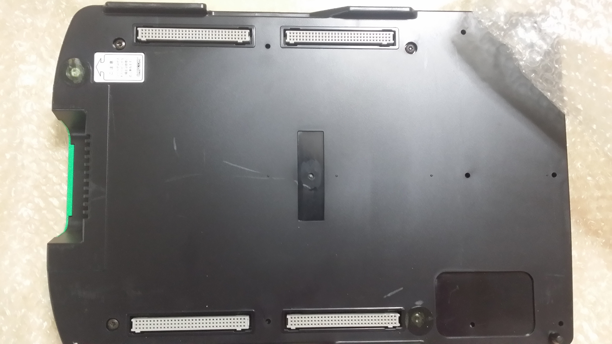

.. post:: 2016-09-11
   :tags: VIDEOGAME
   :category: Other
   :author: usaturn
   :location: Japan
   :language: ja

========
基板覚書
========

概要
====
10年以上前に触ってたアーケードゲームの基板を @hirokiky に譲る事にしたので注意事項をしたためておく

接続図
======

   接続した際の全体像

モニタ出力について
==================
二種類のケーブルが付いてます

ビデオコンポジット出力
======================
黄色い RCA ピンです。見ればわかると思います。
大抵の TV ならついているんじゃないかと。

RGB21ピン出力
=============

こっちの方が画質が良いけど接続方法が限られます。

1. 昔の SONY の RGB21 ピン付きの TV や PC98 のモニタを手に入れる
2. XRGB などのアップスキャンコンバータを使って PC モニタに VGA 出力する

モニタ注意事項
==============
縦シューをプレイする場合は、縦置きする必要があるので、VGA 出力をしてなおかつ縦回転できる PC モニタという環境が必要。
専用モニタを買うという手もあるけど、重いし高いし邪魔だし、素の奴は電源的な意味合いで危険。

最近のコントロールボックスは HDMI 変換があるらしいので、コントロールボックスを買いなおすという事も視野に入れていいかも。

ハーネスの接続について
======================

とにかく固いです。逆差しをしないようによく見て基板を壊さないように強く差し込んでください。

また、基板を触る時は静電気に気を付けて、どこか金属を触って放電してから扱うように。

ボタン等
========

コントローラ側にスタートボタンやクレジットボタンが付いてない事に注意してください。

スタートボタンの押し方
======================

ごめんなさい、1Pスタートボタンのケーブルが外れてしまったので、1Pスタートについている黒いケーブルの先を基板側の JAMMA ハーネスの GND に接触させながらスタートボタンを押してください。
本来ならちゃんと半田付けをしなおすところなのですが・・・

CPシステムⅡについて
====================

CPシステムⅡ のゲームは「スーパーストリートファイターⅡX」と「ヴァンパイアハンター」をつけてますが、緑色の部分がサブボード、昔の家庭用ゲーム機でいうところのカセットになっていて、下の黒い部分がマザーボードでサブボードを交換してゲームをします。
交換する際に注意しなければいけないのが、ピンです。簡単に折れてしまうので無理に押し込まずにハマったかなという感触があったところで優しく押してあげてください。

以上

