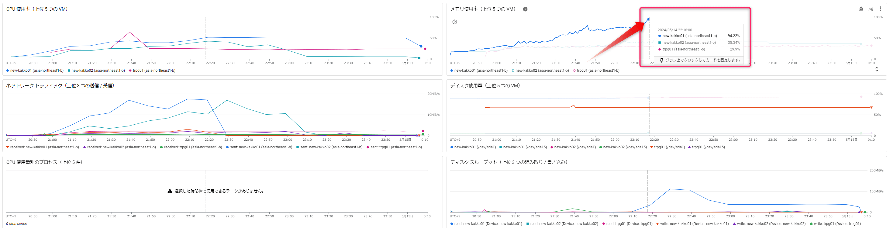

.. post:: 2024-12-11
   :tags: Ubuntu, Linux, resonite, VR
   :category: "IT technology"
   :author: usaturn
   :location: Japan
   :language: ja

.. _about_operating_a_resonite_headless_server_on_gce_for_one_year:

================================================================================
Google Cloud Compute Engine で resonite ヘッドレスサーバを運用しての感想（駄文）
================================================================================

`(2枚目) Resonite Advent Calendar 2024 <https://adventar.org/calendars/10544>`__ 11日目の記事です

定期運用として 2023/10/17 ～ より `ボドゲ喫茶かっこう <https://x.com/Hamadori_vrq/status/1711211032612569201>`__ を毎週火曜日に 2 インスタンス起動しています。
また、2024/2～2024/7毎週土曜日に初心者案内デー用のインスタンスを起動していました

他に月に数回 TRPG 用で自身が使う卓用の ヘッドレスサーバ_ を起動しています

トラブルについて
================

少なくないトラブルに遭遇しています

起動時
------

- resonite のアップデートミス

  - resonite_ がアップデートしていて ヘッドレスサーバ_ のバージョンと差異がありセッションに参加できない事象があった

    - 起動スクリプトに steamcmd でアップデートする処理を入れることで対応

  - 空き容量が足りなくなり、アップデートができなかったことが2回あった

    - キャッシュ削除で対応: ${HOME}/.local/share/Steam/steamapps/common/Resonite/Headless/Cache/Cache

  - 空き容量が足りていてもなぜか steamcmd でアップデートできない事がある。何回かアップデートを繰り返すとうまくいく（原因不明）

    - steamcmd の引数に validate を入れることでうまくいくことがあったが、さらに別のエラーが出ることもあり様子見

- resonite ネットワークに繋がらなかった

  - 原因不明。同じタイミングで他の人も自宅ヘッドレスを起動しても入れなかった

- 指定したマシンタイプが、Google 側のリソース不足で起動できなかった

  - n2 や n2d は使用時間が多くなればなるほど月割引が効くためか（推測）リソース不足で起動できないことがあった。マシンタイプを t2d に変更することで対応

ヘッドレスサーバ_ クラッシュ
----------------------------

起動中に ヘッドレスサーバ_ のセッションがクラッシュしてユーザが追い出されたり、再度参加できなくなることが度々ありました。
ほとんどの場合、原因がわかりません

.NET8 版になってからは一度も遭遇しませんでしたが、.NET9 版では一度発生しています

他に .NET 版では、まだ発生していませんが、メモリリークで落ちることがしばしばありました

その他
------

音声コーデックが Ogg Vorbis の不具合

  - 音声コーデックが Ogg Vorbis のファイルを BGM として流していた際、CPU 負荷 100% 張り付き状態で何度かクラッシュしたことがあります。
    その時は原因がわかりませんでしたが、他の方にヘッドアリ（つまり通常クライアント）でホストになってもらった時にクラッシュしないまでも CPU 負荷 100% になり
    調べてもらった所、原因が Ogg Vorbis を流しているプレーヤーだということがわかりました（mp3 や Opus は問題なし）

Linux 版は Windows 版より不安定な可能性アリ

  - あくまでも個人の肌感ですが、Linux 版は、起動時に特定のカレントディレクトリから実行すると起動失敗するとか、存在しないディレクトリを求められるとか、
    前出の原因不明のメモリリークが少なくない頻度であったという事象が記憶に残っています。

    開発側では Linux 版の試験工数を、あまり取ってないような気がしてなりません……（気のせいだとは思う）

起動しっぱなしで料金が嵩む

    - GCE インスタンスは従量課金なので、起動しているのを忘れてしまった場合、意図しない料金が発生する可能性があります。
      shutdown ユニットを作ったり、全てのインスタンスに深夜 2 時頃には停止するスケジュールを組み込むと良いです。
      ここで詳細を述べるほどのことではありませんので、知りたい方がいらっしゃれば直接声を掛けてください

ネットワーク帯域をそこそこ消費することがある

   - かっこうの場合は、ちょいちょい瞬間的に 20MB/s 程度消費することがありますが、まれに 40MB 以上消費していることがあります。
     下図はリアルタイムでモニタリングをしていてたまたま見つけましたが、上り 43MB = 344Mbps といった所でしょうか

   .. figure:: images/2024-09-10_43MB.webp
      :scale: 30%

挑戦したいこと
==============

この先やってみようかなと考えていることです（全然やらないかも）

自分以外の人がインスタンスを制御する
------------------------------------

コミュニティ運用しているヘッドレスサーバについては、権限付与した人が任意の GCE インスタンスを起動／停止／再起動できるようにしたい。
また、Discord bot または Web アプリでヘッドレスサーバ貸出しができるといいんじゃないかと考えてますが、利用設計難しいですね。
無限に貸出は無理だし、申し込みした人の resonite ID の validate 方法もあるのかな？

便利 mod を入れる
-----------------

世の中には便利な mod があるらしいので入れてみたい。
なんも調べてませんが「これは入れておけ！」という mod があればどなたか教えてください！

Arm64 版を使ってみる
--------------------

`ばるさんが Arm64 で運用しているらしい <https://zenn.dev/hantabaru1014/articles/bbe64003d75141>`__ ので、自分も Google Cloud の Arm64 マシンタイプにトライしてみたいと考えています。
Google Cloud は Oracle Cloud のように無料で運用できるわけではありませんが、コストパフォーマンスは高そうです。
しかし、知見がない自分がゼロから始めるには結構手間かかりそう……

監視する
--------

現状では短時間運用（長くても 10 時間程度）しかしてない上に、自分かコミュニティの人が使っている為、落ちた時は人的手段で通知されるので、あまり必要性を感じていません。
が、Cloud Monitoring で監視して、なんらかの異常を検知しリアルタイムに異常状態の時の挙動を確認するような使い方であれば意味があるかも。
優先順位低めで検討してます。

最後に
======

`筆者 <https://bsky.app/profile/usaturn.net>`__ の 2024 年アドベントカレンダー 10 日分を書き終えました。
ヘッドレスサーバ_ に関する知見の 8 割程度は吐き出せたかと思ってます。
全てに目を通してくれている方がいらっしゃるとは思えませんが、少しでも読んで頂けたなら幸いです。
もし、よろしければフィードバックを頂けるとうれしいです

それでは、 resonite_ でお会いしましょう！

:resonite ID: usaturn
:VRChat ID: usaturn

PS: 実は 1 年前のアドベントカレンダーに書きたかった内容を温めすぎていました。量が多いので腰が重かったですし、いったん書き始めてからも、かなりの工数がかかりました……

.. include:: /contents/include_files/resonite_headless_link.txt

