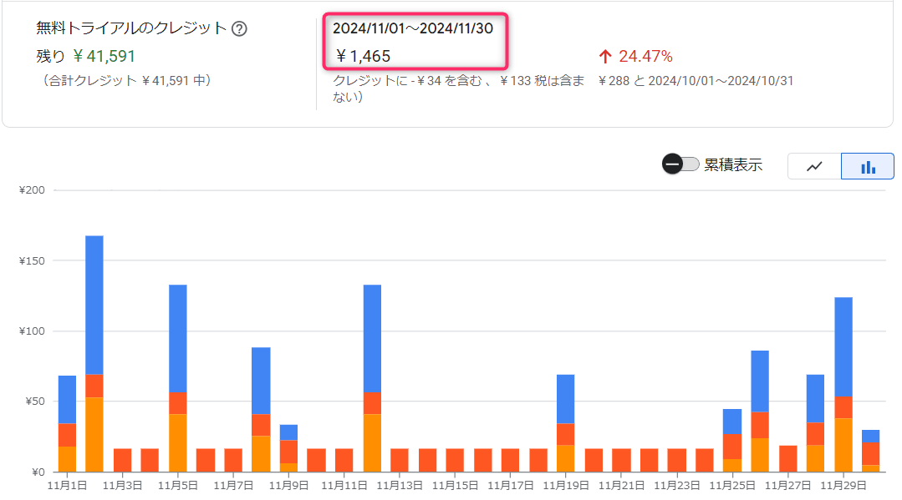

.. post:: 2024-12-09
   :tags: Ubuntu, Linux, resonite, VR
   :category: "IT technology"
   :author: usaturn
   :location: Japan
   :language: ja

.. _check_the_price_and_choose_an_instance:

====================================================
ヘッドレスサーバ_ に使うマシンタイプの選び方と費用感
====================================================

`(2枚目) Resonite Advent Calendar 2024 <https://adventar.org/calendars/10544>`__ 9日目の記事です

この記事では :ref:`set_up_a_resonite_headless_server_on_compute_engine` で構築した ヘッドレスサーバ_ の運用費とマシンタイプについて解説します

利用料金を確認しよう
====================

#. `Billing <https://console.cloud.google.com/billing/>`__ をブラウザで開き、 **請求先アカウント名** から該当する項目をクリックします

   .. figure:: ./images/report_kakin.png
      :scale: 40%

#. レポートをクリックし、右側のフィルタを見たい条件に合わせてください

   .. figure:: ./images/specify_sku.png
      :scale: 40%

上記は先月 2024 年 11 月分の筆者の resonite 用プロジェクトのレポートを表示したところです。
グループ条件に **SKU** を指定すると、どのリソースにいくら掛かったのかが詳細にわかります。

   .. figure:: ./images/sku_costs.png
      :scale: 40%

上から順番に、CPU、ディスク、メモリの料金となっています

  T2D AMD Instance Core running in Japan

  - マシンタイプ `Tau T2D  <https://cloud.google.com/compute/docs/general-purpose-machines?hl=ja#t2d_machine_types>`__ の CPU 料金

  Storage PD Capacity in Japan

  - `ディスク料金 <https://cloud.google.com/compute/disks-image-pricing?hl=ja#tg1-t0>`__
  - インスタンスが起動していない時にも料金がかかることに注意してください

  T2D AMD Instance Ram running in Japan

  - マシンタイプ `Tau T2D  <https://cloud.google.com/compute/docs/general-purpose-machines?hl=ja#t2d_machine_types>`__ のメモリ料金

先月は 3 台のマシンを保持し、合計 50 時間弱の起動で 1500 円程度でした。
内訳は `ボドゲ喫茶かっこう <https://x.com/Hamadori_vrq/status/1711211032612569201>`__ を毎週 2 店舗、20:30～24:00 運営と、1 回 8 時間前後の TRPG セッションを 2 回くらいです

マシンタイプを変更してみよう
============================

インスタンスを作成する際に、実はマシンタイプを指定しています。
作成するコマンドで指定している引数 **--machine-type=${MACHINE_TYPE}** がそれです ::

   gcloud compute instances create ${RESONITE_HEADLESS_SERVER_INSTANCE_NAME} \
       --tags=${FIREWALL_TAG_NAME} \
       --image-project=${IMAGE_PROJECT} \
       --image-family=${IMAGE_FAMILY} \
       --image-family-scope=${IMAGE_FAMILY_SCOPE} \
       --machine-type=${MACHINE_TYPE} \
       --subnet=${SUBNET_NAME} \
       --metadata-from-file=user-data=${SETUP_RESONITE_HEADLESS_SERVER_SCRIPT} \
       --network-tier=STANDARD \
       --scopes cloud-platform

:command:`echo ${MACHINE_TYPE}` を打つと **t2d-standard-2** が表示されます。
これは :command:`env-headless-server.bash` の中で指定しています

**t2d-standard-2** は `Tau T2D マシンシリーズ <https://cloud.google.com/compute/docs/general-purpose-machines?hl=ja#t2d_machines>`__ によると「基本周波数 2.45 GHz、有効周波数 2.8 GHz、最大ブースト周波数 3.5 GHz の第 3 世代の AMD EPYC Milan プロセッサ」とのことです。

**t2d-standard-2** は 2CPU、8GB メモリのインスタンスで以下のような意味があります

    :t2d: Tau T2D マシンシリーズ
    :standard: CPU 数とメモリ構成のパターン。CPU 数が 2 の場合はメモリが 8GB
    :2: CPU 数が 2つであることを示している

2023 年 10 月 resonite リリース当初から `ボドゲ喫茶かっこう <https://x.com/Hamadori_vrq/status/1711211032612569201>`__ で負荷を見ながらマシンタイプを変更し、価格面と性能面のバランスを取り模索した結果、採用に至ったのが **t2d-standard-2** です(1年以上前の話なので、今ではもっといいマシンタイプがあるはず)

以下は resonite リリース月(2023年10月)のかっこうの GCE インスタンスのモニタリング結果です

   .. figure:: ./images/kakko2023-10-31.png
      :scale: 20%

2台とも10人前後参加していたと思われますが、CPU 負荷は 60% 程度、メモリ使用率 80% 程度(6.4GB)であることがわかります。
次の画像は、2024年8月に .NET8 版がリリースされた時のモニタリング結果です

   .. figure:: ./images/kakko2024-08-06dotnet8.png
      :scale: 20%

.NET8 版が、CPU 負荷 40% 程度、メモリ使用率 40% 程度でかなり負荷が下がったことがわかります（現行の .NET9 版も同様です）

上記より、 ヘッドレスサーバ_ に重い処理をさせるのでなければ、10数人を 2CPU、メモリ8GB程度で十分さばけることがわかっています。
もし、 ヘッドレスサーバ_ に重い処理をさせたければ、より高性能なマシンタイプに変更すると良いでしょう。
resonite_ は並列処理が苦手で CPU クロックが高い方が有利と聞いたことがあります。

筆者が、検討しているマシンタイプは以下の通りです。

.. list-table::
   :header-rows: 1

   * - マシンタイプ
     - CPU 数
     - メモリ
     - 時間単価
     - 備考
   * - t2d-standard-2
     - 2
     - 8GB
     - $0.108396
     - 本手順で標準使用
   * - c4-standard-2
     - 2
     - 7GB
     - $0.12439532
     - t2dより高性能
   * - c4-highcpu-2
     - 2
     - 4GB
     - $0.10922378
     - メモリ量に注意
   * - n4-standard-2
     - 2
     - 8GB
     - $0.1217062
     - t2dより高性能
   * - n4-highcpu-2
     - 2
     - 4GB
     - $0.10268977
     - メモリ量に注意
   * - c3-highcpu-4
     - 4
     - 8GB
     - $0.218448
     - t2dより高性能
   * - c3d-highcpu-4
     - 4
     - 8GB
     - $0.17359701
     - t2dより高性能
   * - e2-standard-2
     - 2
     - 8GB
     - $0.087651
     - 共有マシン。性能悪

価格は2025年1月時点の東京リージョンの価格です。
詳細については `Compute Engine の汎用マシン ファミリー <https://cloud.google.com/compute/docs/general-purpose-machines?hl=ja>`__ を確認してください

マシンタイプを変更してインスタンスを作成する場合は :ref:`explaining_resonite_headless_server_on_compute_engine` や :ref:`clone_a_headless_server_instance` の手順で変数 **MACHINE_TYPE** を指定し直してください

マシンイメージからインスタンスを作成する例 ::

    INSTANCE_NAME=headless-server02
    MACHINE_TYPE="c4-highcpu-2"
    gcloud compute instances create ${INSTANCE_NAME} \
        --machine-type ${MACHINE_TYPE} \
        --source-machine-image=${MACHINE_IMAGE_NAME} \
        --zone=${ZONE}

マシンタイプの注意事項
----------------------

比較的安めの n2 や n2d を入れていない理由は2023年末の時点では、たびたび Google Cloud のリソース不足で起動できないことがあった為です。
スケジュールしている場合、外出していたりして即時対応ができないこともあるので避けています。

リソース不足になる理由は、どちらのマシンタイプも長時間起動する場合、月額割引が大きいため、スケーリングさせるサービスで多用されているからだと考えられます

以上

:ref:`明日の記事 <explanation_of_setup_config>` へ続きます。

.. include:: /contents/include_files/resonite_headless_link.txt

