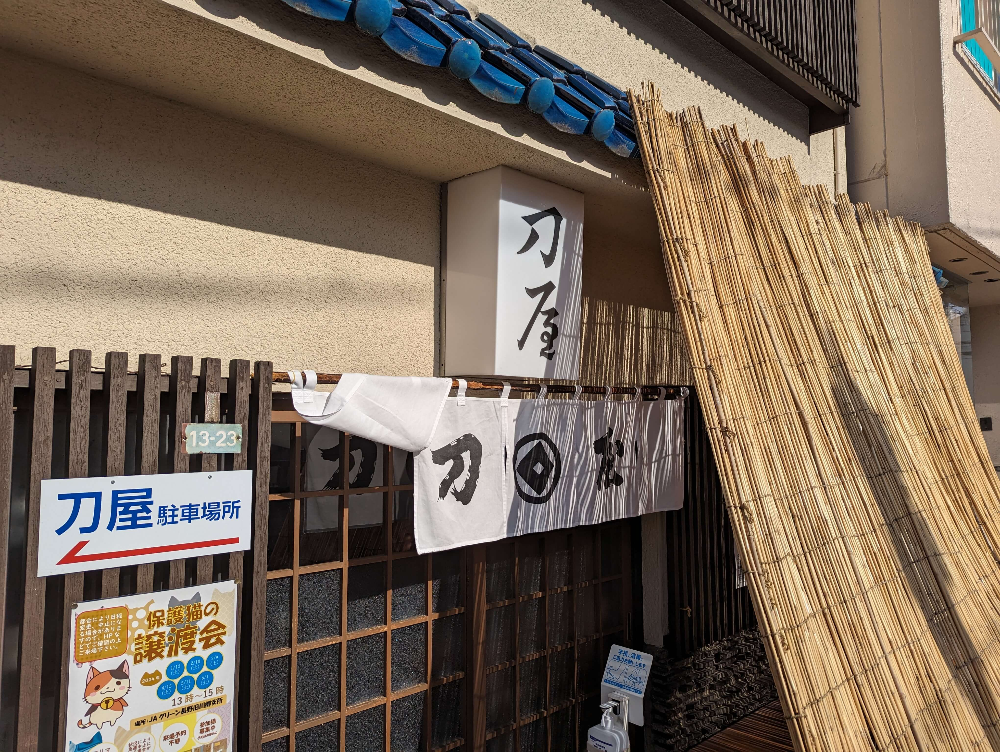
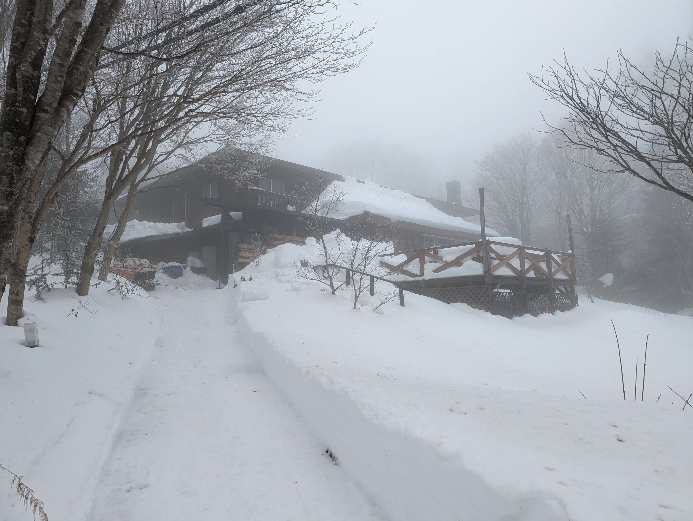
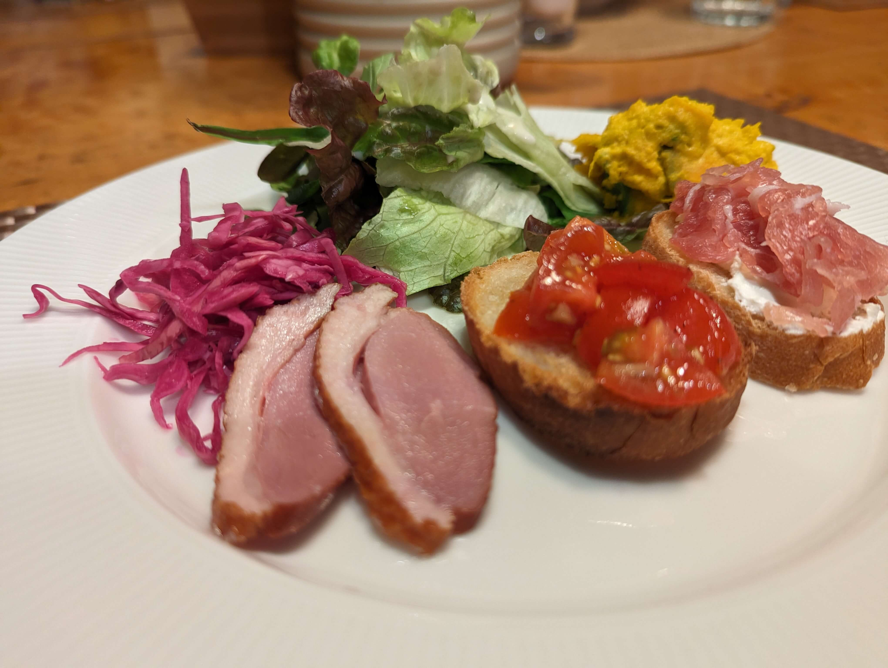
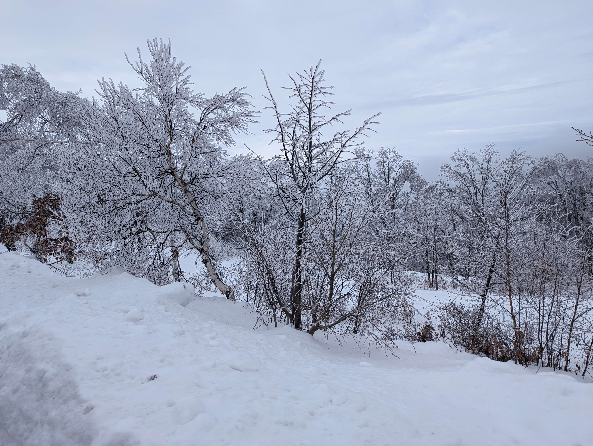

.. post:: 2024-01-24
   :tags: pyhack, python, sphinx, IT勉強会, 備忘録
   :category: 駄文
   :author: usaturn
   :location: Japan
   :language: ja

.. _pyhack_snow_mountain_camp2024:

=====================================
Python mini hack-a-thon 雪山合宿 2024
=====================================

Pyhack 備忘録
=============
たまには勉強会（？）参加記録でも付けてみようと思い立ちました。

2011 年あたりから `Python mini hack-a-thon(通称 pyhack) <pyhack>`_ というイベントに参加していたみたいです。
pyhack_ は大体月に1度、親切な企業さんの一室を借りて、Python が好きな人たちが集まって、好き勝手に作業をする会です。
時には Python に全く関係ない事をする人たちも珍しくありません。

現在は `株式会社ビープラウドさん <https://www.beproud.jp/company/>`__ が運営する
`エンジニアをつなぐIT勉強会支援プラットフォーム「CONNPASS」 <https://connpass.com/>`__
で参加者を募集していますが、以前は ATND(サービス終了済)というサービスを利用しており、昔の募集記録が残っていないのが残念です。

歴史も長く、去年は `カンファレンス <pyhackcon>`_ も開かれました。
時系列を、 中神さん_ が Gist_ にまとめてくださっているので、たまに見返す事にします。

pyhack_ は年に2回、夏と冬に長野山中で合宿をしています。

冬の合宿では通常回よりも、さらに自由なことをしており、昼はスキーやスノボをやって夜はアルコールを呑んで雑談したり、ボードゲームを遊んだりする人たちも多いです。

自分は `2013 年の雪山合宿 <https://pyhack.connpass.com/event/1308/>`__ から参加している模様。

そして、今年で `雪山合宿 <https://pyhack.connpass.com/event/302366/>`__ 参加 10 年目のようです(コロナ禍で2回くらい参加してませんが)。

雪山合宿の流れ
==============

1月の中旬～下旬の金曜日～日曜日(二泊三日)で実施されています。 pyhack雪山合宿2024_ は1/19(金)～1/21(日)に実施されました。

:場所: いつも `マウンテンパパ <https://www.mtpapa.jp/>`__ というペンションに泊まっています。長野県の「峰の原」です。すぐそばにスキー場があります
:最寄り駅: 北陸新幹線で上田駅です。東京駅から1時間半くらい
:駅からペンションまで: バスで 40 分くらい。大抵の人は12時頃に上田駅へ到着し、刀屋というお蕎麦さんでお昼をとってからバスに乗ります

ペンションについてからは、端末を開いて作業をするなり、雑談をするなり各自思い思いの行動をしています。
初日は夕飯の時間になったら、全員集まり自己紹介と今回やることを軽く話します。
夕飯の後はお風呂に入ったりアルコールを飲んで騒いだり、ゲームをしたり、ひたすらコードを書いたり色々です。

   お昼は行きつけの `刀屋 <https://rurubu.jp/andmore/spot/80018859>`__ へ

   天ざるの中盛りがお勧め

   雪に覆われたペンション

   夕飯のオードブル

   メインディッシュ

   昼間は銀世界をお散歩

2024 の雪山合宿
===============

今回は、ブログを書こうと思ったのですが、8年程ブログを放置していたので、色々手間取りました。

去年変更していた GitHub や Gitlab の鍵に半年に1回しか起動しないノート PC の WSL 環境が対応していなかったので、せっかくだから 1Password で SSH 鍵を管理してみようとして失敗したり、WSL の Gentoo 環境がメンテしてなさすぎて Python 環境が壊れていて復旧しようとして諦めたり、Netlify で使用しているブログツール `ablog <https://ablog.readthedocs.io/en/stable/>`__ が Netlify の Python バージョンと合わずに、Cloudflare に移行してみたりと、ブログ記事を書き始めるまで丸一日くらいかかりました。

近年、自分は通常回の pyhack_ にほとんど参加しなくなってしまったので半年ぶりに会うような人たちも多く、雑談しているだけで楽しかったり勉強になったりする事が多く大変ありがたいです。

今回の雪山合宿の成果はこちらの記事です。

.. _pyhackcon: https://pyhack.connpass.com/event/282942/
.. _Gist: https://gist.github.com/nakagami/f4dff761c45ce1d91a3227fc9c58c3ff
.. _pyhack雪山合宿2024: https://pyhack.connpass.com/event/302366/
.. _pyhack: https://pyhack.connpass.com/event/
.. _中神さん: https://twitter.com/hajime_nakagami
